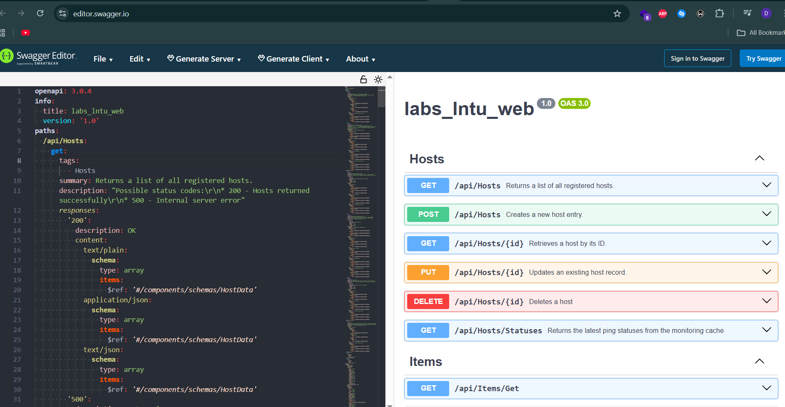

# Pinger System 

## Overview  
Pinger is a monitoring system designed to continuously ping configured hosts and record connectivity statistics. It provides historical analysis of response times, including minimum, maximum, and average latency metrics. The system enables administrators and users to track network stability and react to issues promptly.  
The solution aims to simplify network supervision by offering a centralized interface where hosts can be added, removed, and monitored, ensuring ongoing visibility of uptime and latency trends.

## User Roles  
- **Administrator** – Can add and remove hosts, view statistics, configure monitoring settings, and manage user access.  
- **User** – Can view statistics, history, and status of monitored hosts.

## Core Usage Scenarios  
1. Administrator adds a new host for monitoring.  
2. System continuously pings hosts and updates stored statistics.  
3. User opens dashboard to review host status and latency history.  
4. Administrator removes or disables a host no longer monitored.  
5. User checks alerts or anomalies indicating connectivity issues.

## Functional Requirements  
- System must allow creation, deletion, and configuration of monitored hosts.  
- System must continuously ping all active hosts at configured intervals.  
- System must store statistics: last response, minimum, maximum, average latency, and historical logs.  
- System must provide dashboards or reports accessible to both roles.  
- System must enforce role-based permissions.  

## Non-Functional Requirements  
- The system should be responsive and capable of updating dashboards in near real-time.  
- It must reliably store long-term historical data.  
- It should be secure, preventing unauthorized access or tampering.  
- The interface should be easy to navigate and understand.  
- The system should scale to monitor a growing number of hosts.

## Constraints  
- The system will not attempt to automatically repair network failures.  
- It will not perform active intrusion detection or network diagnostics beyond ping statistics.  
- It will not provide complex analytics such as machine learning-based prediction.

## API Documentation
- [Reference](./docs/api/openapi.yaml)
- 

## Local docker build and run
- `cd .\labs_lntu_web`
- `docker build -t pinger-dotnet:1.0.1 .`
- `docker run --name pinger-2 --rm -d -p 8080:8080 pinger-dotnet:1.0.1`
- `docker logs -f pinger-2`

## CI/CD run
- `docker pull ghcr.io/devlonic/labs_lntu_web-web:latest`
- `docker run -p 7777:8080 ghcr.io/devlonic/labs_lntu_web-web:latest`